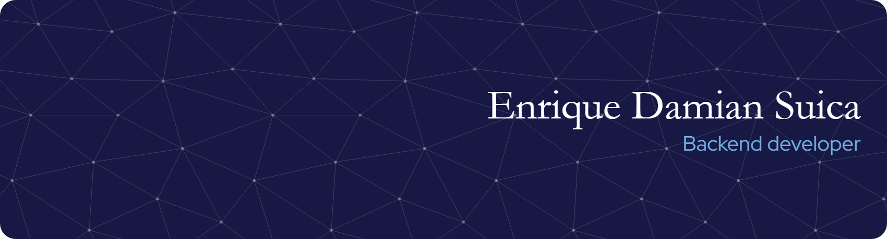

<h1 align="center">Welcome! </h1>

## About me
<h4 align="center">I am a Junior Backend developer, computer engineer student. I like to Code, Design, Innovate and Experiment. I am an enthusiastic and a social person who loves to take up new challenges and learn new skills. I love meeting new people, exchanging ideas and spreading knowledge and positivity.

</h4>

<!-- stats -->

<!--
**enridami/enridami** is a ✨ _special_ ✨ repository because its `README.md` (this file) appears on your GitHub profile.

Here are some ideas to get you started:

- 🔭 I’m currently working on ...
- 🌱 I’m currently learning ...
- 👯 I’m looking to collaborate on ...
- 🤔 I’m looking for help with ...
- 💬 Ask me about ...
- 📫 How to reach me: ...
- 😄 Pronouns: ...
- ⚡ Fun fact: ...
-->
